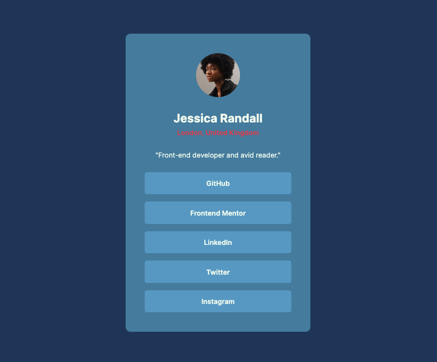

# Frontend Mentor - Social links profile solution

This is a solution to the [Social links profile challenge on Frontend Mentor](https://www.frontendmentor.io/challenges/social-links-profile-UG32l9m6dQ). Frontend Mentor challenges help you improve your coding skills by building realistic projects. 

## Table of contents

- [Frontend Mentor - Social links profile solution](#frontend-mentor---social-links-profile-solution)
  - [Table of contents](#table-of-contents)
  - [Overview](#overview)
    - [Screenshot](#screenshot)
    - [Links](#links)
  - [My process](#my-process)
    - [Built with](#built-with)
    - [Continued development](#continued-development)
    - [Useful resources](#useful-resources)

## Overview
This is a profile card for a user with social media links. The top section contains the user's profile picture and name. The bottom section contains the user's social media links. The card is designed in the way that the user can interact with the links by hovering and focusing on them.

### Screenshot

### Links
- Live Site URL: [https://py-code314.github.io/social-links-profile/](https://py-code314.github.io/social-links-profile/)

## My process

### Built with
- Semantic HTML5 markup
- CSS custom properties
- Flexbox
- CSS Grid
- Mobile-first workflow

### Continued development
- Like to learn more about BEM nomenclature. Also like to learn how to properly name custom properties in CSS. Making use of @font-face needs further research.

### Useful resources
- Found a different [resource](https://fluid.style/spacing?min=0.625&max=1.375&min-bp=23.4375&max-bp=90&unit=%22rem%22) for `clamp()` function. You can choose to get values for both fonts and spacing, and can see a live preview which I think is very helpful

